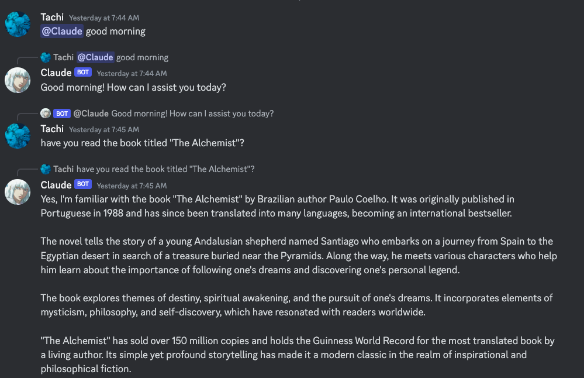
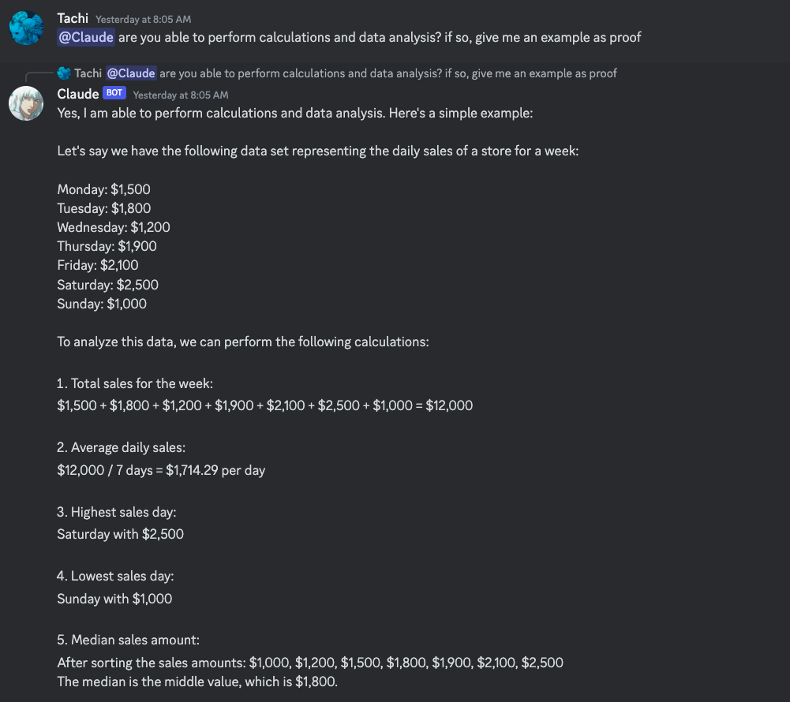

# Claude Opus Discord Bot

This Discord bot allows users to chat with the Claude Opus large language model (LLM) within Discord, utilizing the Anthropic API to process and respond to user messages.





## Setup Instructions

Follow these steps to set up the bot in your environment:

### Prerequisites

- Python 3.8 or higher
- `nextcord` library
- `requests` library

### Installation

1. **Clone the repository:**

```bash
git clone <repository-url>
cd <repository-name>
```

2. **Install dependencies:**

```bash
pip install nextcord requests
```

3. **Set environment variables:**
You need to set two environment variables for the bot to function correctly:

- DISCORD_BOT_TOKEN: Your Discord bot token.
- ANTHROPIC_API_KEY: Your API key for accessing Anthropic's API.
  
You can set these variables in your shell or directly in your code for testing purposes. For production, it is recommended to use a more secure method of setting environment variables.

**Running the Bot:**
Navigate to the bot's directory and run the following command:

```bash
Copy code
python <main-file-name>.py
```
Replace <main-file-name> with the name of your main bot file.


**Using the Bot:**

Once the bot is running and has been added to your Discord server, you can interact with it by mentioning the bot followed by your message. The bot will process your message using the Anthropic API and respond in the channel.


**Troubleshooting:**
If you encounter any issues while setting up or running the bot, ensure that:

- Your environment variables are correctly set.
- You have the latest versions of nextcord and requests installed.
- Your bot has the necessary permissions on your Discord server.
  
For more detailed error information, you can add logging to the bot's code or consult the Discord and Anthropic API documentation.


